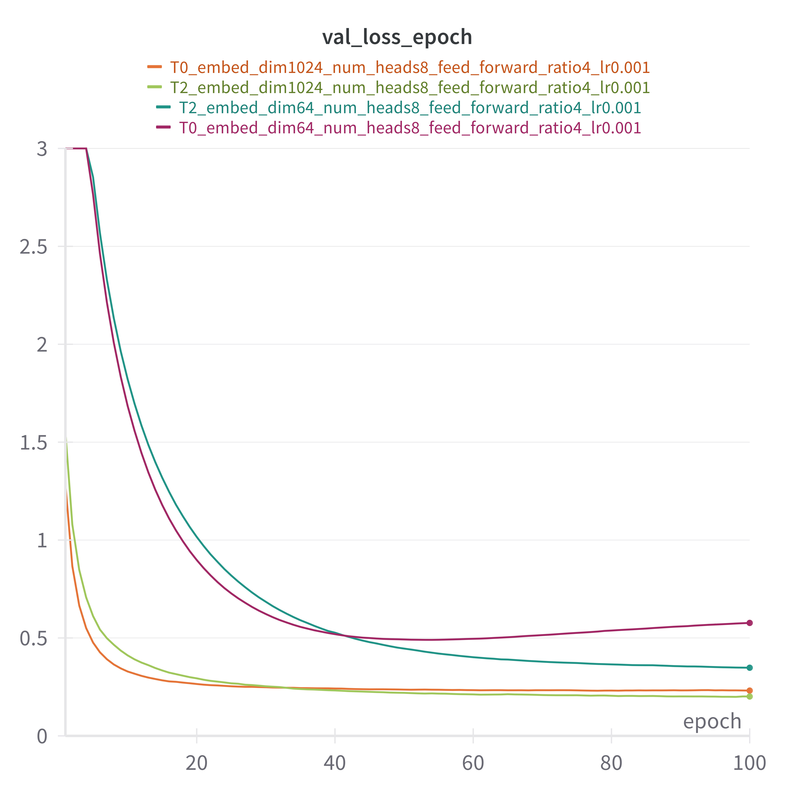

# A new algorithm for LLM training 

 Usually in causal next-token prediction training of large languge models one uses cross-entropy loss 
<table align="center">
<tr><td>

</td></tr>
</table>

Here $p_i$ is the probabilities for the $i$-th token present in the ground truth label. At late in the training phase $p_i \sim 1$ and we can Taylor expand the loss using 
<table align="center">
<tr><td>

</td></tr>
</table>

To take into account higher order statistics of $p_i$ we can use modified loss functions as follows
<table align="center">
<tr><td>

</td></tr>
</table>
<table align="center">
<tr><td>

</td></tr>
</table>

Now we present plot comparing different losses and show that $T_2, T_1$ are much more stable compared to cross entropy $T_0$ and in terms of minimum validation loss they are superior.

    

Above experiment is performed on a transformer having 1 attention layer with 8 heads of embed_dim 64, 1024 and feed_forward_ratio 4. We use "stanfordnlp/SHP" dataset with gpt2 tokenizer. For more details of the training process see the code in this repo. This code is being developed as part of an on-going research project and any use of the code without permission is restricted.

# Applications in reinforcement learning

We are presented with a prompt $x$ and a set of $K$ answers with ground truth preference $y_1> \ldots>y_K$. The language model generates response $y$ form $\pi_\theta(y|x)$. We define penalty/error  $E(y|x)$ for response $y$ using the following formula
<table align="center">
<tr><td>

</td></tr>
</table>

Given a permutation $\tau$, the Plackett-Luce model assigns a probability distribution for the generated response of the language model
<table align="center">
<tr><td>
\ldots>y_{\tau(K)}|x)=\prod_{k=1}^{K}\frac{\exp(-E(y_{\tau(k)}|x))}{\sum_{j=k}^{K}\exp(-E(y_{\tau(j)}|x))}" />
</td></tr>
</table>

In usual approach to reinforcement learning we minimize the following objective 
<table align="center">
<tr><td>
y_2>\dots>y_K}\bigl[log\hspace{0.1cm}p(y_1>y_2>\dots>y_K|x)\bigr]" />
</td></tr>
</table>

In Proximal Policy Optimization (PPO) one solves the last equation to get $E$ and then finds the optimal model from the first equation. On the other hand, for Direct Preference Optimization (DPO), first one finds $E$ in terms of $\pi_\theta$ from the first equation and then solves the last equation to find optimal $\pi_\theta$. This leads to the following effective objective
<table align="center">
<tr><td>
\dots>y_K}[log\prod_{k=1}^{K}\frac{e^{T\hspace{0.1cm}log\frac{\pi_{\theta(y_{k}|x)}}{\pi_{ref}(y_{k}|x)}}}{\sum_{j=k}^{K}e^{T\hspace{0.1cm}log\frac{\pi_{\theta}(y_{k}|x)}{\pi_{ref}(y_{k}|x)}}}]" />
</td></tr>
</table>

Note that the loss above is written only in terms of log probabilities and hence we can use the approximation mentioned above to take advantange of higher order statistics. These ideas can be also applied in PPO with additional statistical reinforcing on reward $r=-E(y|x)$ for given $x$ as follows. We can always construct renormalized reward $R=\sum_{k=0}^{n} c_k r^k$ such that $\mathbb{E}(R)=0, \mathbb{E}(R^k)=1, k=2,3,\dots,n$ (typically it is possible to set $c_n=0$). Finally, in the loss function we can replace $r$ with $R$. 

## Self-play fine tuning
Self-Play Fine-Tuning (SPIN) corresponds to $K=2$. In this case we set $\pi_{ref}=\pi_{\theta(t)}, y_1\sim \pi_{data}(y_1|x), y_2\sim\pi_{\theta(t)}(y_2|x)$. It can be easily generalized using the above formula to incorporate several past steps. 

## Self-play based knowledge distillation
We can use the above method with $K=3$ for self-play based knowledge distillation. In this case we set $\pi_{ref}=\pi_{\theta(t)}, y_1\sim \pi_{data}(y_1|x), y_2\sim\pi_{LLM}(y_2|x), y_3\sim\pi_{\theta(t)}(y_3|x)$. Here we are using a larger languge model for assistance in generating $y_2$. 

